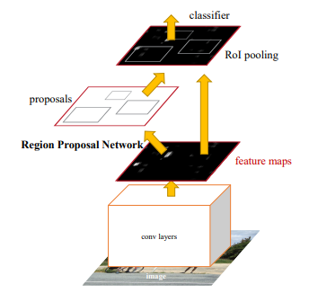
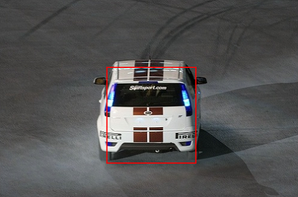

# Faster R-CNN implementation

This repo contains my implementation of Faster R-CNN proposed in <a href='https://arxiv.org/abs/1506.01497'>this paper</a>.

  
  

## File structure

Files can be found in src folder. Source code is split into following files:
* model.py
    * contains FasterRCNN class and other aux modules and classes
* rpn_loss.py
    * contains RPNLoss module which is used as a criterion for a region proposal task.
* train.py
    * defines hiperparameters, initialises FasterRCNN class and invokes its train methods
* utils.py
    * contains aux functions used in implementation

## Modules implemented

Main class/module is FasterRCNN. It contains the following modules:
* FeatureExtractor
    * Shallow CNN which outputs feature map
* RegionProposalNetwork
    * Module for region proposal
* ROIPoolingLayer
    * Module for region pooling
* Classifier
    * Module used for final classification task

Note: this implementation is still work-in-progress. Region classification task is yet to be fully implemented.